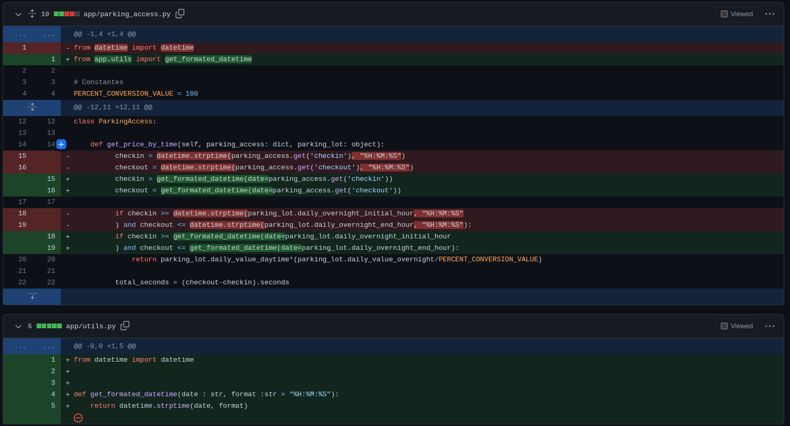
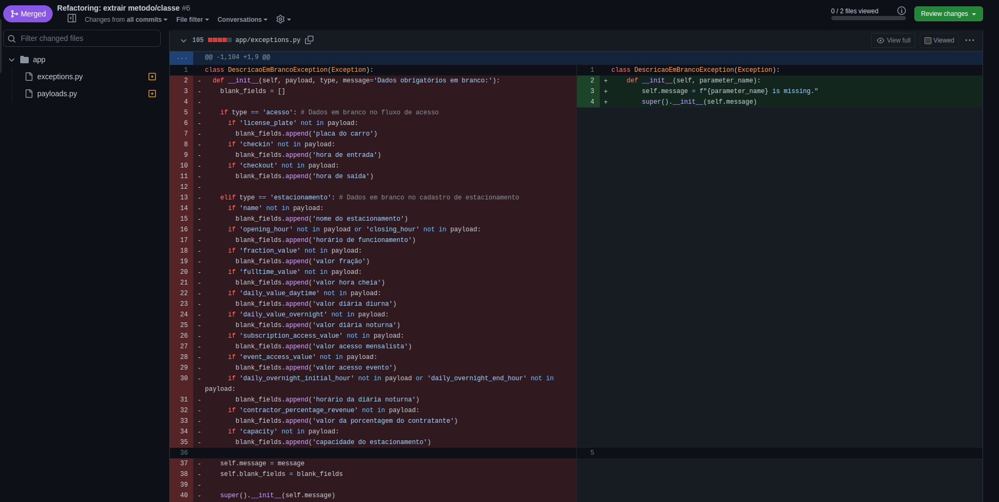

Este documento tem como objetivo realizar a entrega do TP3, documentando os requisitos solicitados no enunciado. As 5 características escolhidas pelo grupo foram:

1. Boa documentação;
2. Ausência de duplicidades;
3. Simplicidade;
4. Idiomático;
5.

# 1. Boa documentação

## 1.1 Descrição

Esta característica possui como efeito no código, a melhoria na claridade do projeto e do código, visto que uma boa documentação serve como guia para os desenvolvedores e interessados no sistema.

## 1.2 Relação com mau-cheiros

Esta característica possui relação com o mau-cheiro comentários, visto que este mau-cheiro diz respeito em como o código explica sobre si mesmo, que é justamente o objetivo de uma boa documentação, explicar o código.

## 1.3 Operação de refatoração

Como operação de refatoração para esta característica, o README do projeto foi refatorado para uma melhor explicação sobre o projeto, como pode ser visto na imagem abaixo:

# 2. Ausência de duplicidades

## 2.1 Descrição

Esta característica visa a diminuição de código duplicado, duplicidade esta também conhecida como boilerplate, e os efeitos dessa característica no código é a melhora na manutenibilidade do mesmo, visto que as duplicidades são centralizadas em um lugar só, e também melhora a visibilidade, visto que o código fica mais compactado.

## 2.2 Relação com mau-cheiros

Esta característica tem completa relação com o mau-cheiro código duplicado, já que os dois visam o mesmo problema, que é trechos de código iguais em lugares distindos, que poderiam muito bem ser centralizados em uma única função, classe, objeto ou outra estrutura de programação.

## 2.3 Operação de refatoração

Uma refatoração que visa essa característica pode ser vista a seguir:

Nesta refatoração, foi identificado uma duplicação de código, que dificulta muito a manutenção desta funcionalidade, visto que se for ter uma alteração deve-se alterar a mesma coisa em vários pontos, e com isso, foi criada uma função centralizando a funcionalidade e eliminando a duplicidade.

# 3. Simplicidade

## 3.1 Descrição

Uma das boas práticas na programação consiste em construir um código legível e bem descritivo. E quando uma classe, por exemplo, acaba tento muitas responsabilidades, o entendimento acaba sendo prejudicado e ela acaba tornando-se, muitas vezes em uma classe com pouca ou nenhuma simplicidade.

## 3.2 Relação com mau-cheiros

A característica ou mau cheiro que foi identificado no projeto e onde a simplicidade poderia ser aplicada é a característica de Classe Inchada ou Grande.

## 3.3 Operação de refatoração

Uma exemplo de operação de refatoração que evidencia o ponto da simplicidade está presente em um dos Pull Requests feitos no projeto. No PR em questão é possível perceber abaixo o quanto a classe tinha muitas operações e responsabilidades:

# 4. Idiomático

## 4.1 Descrição

## 4.2 Relação com mau-cheiros

## 4.3 Operação de refatoração